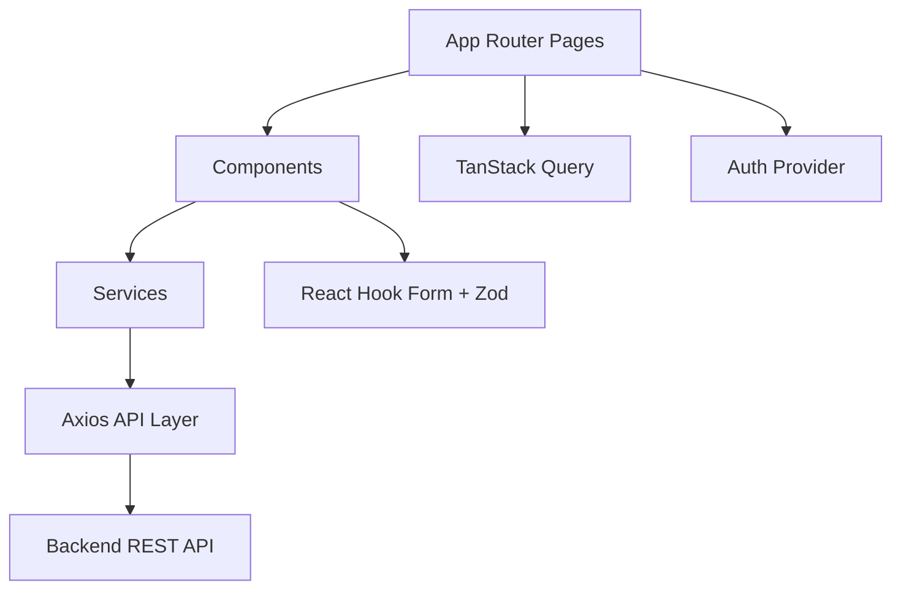

# ExpenseFlow — Frontend

Next.js web application for ExpenseFlow, an expense management system with role-based dashboards and approval workflows.

Part of the [ExpenseFlow monorepo](../README.md). Connects to the [backend API](../backend/README.md).

## Table of Contents

- [Architecture](#architecture)
- [Folder Structure](#folder-structure)
- [Prerequisites](#prerequisites)
- [Setup](#setup)
- [Environment Variables](#environment-variables)
- [Run](#run)
- [Routes](#routes)
- [Key Features](#key-features)
- [Deployment](#deployment)
- [Tradeoffs](#tradeoffs)
- [Future Improvements](#future-improvements)

---

## Architecture



| Layer | Responsibility |
|---|---|
| **App Router** | Pages, layouts, middleware |
| **Components** | UI, forms, tables, timeline, filters |
| **Services** | Typed API calls per domain |
| **lib/api** | Axios instance, token refresh, errors |
| **Providers** | Auth context, React Query |
| **Schemas** | Zod validation for forms and filters |
| **Hooks** | Debounced search, paginated filters |

### Tech Stack

Next.js 16 · React 19 · TypeScript · Tailwind CSS 4 · TanStack Query · React Hook Form · Zod · Axios · Lucide React

---

## Folder Structure

```
frontend/
├── src/
│   ├── app/                    # Next.js App Router
│   │   ├── (auth)/             # Login, signup
│   │   ├── employee/           # Employee dashboard & claims
│   │   ├── manager/            # Manager approval queue
│   │   ├── senior-manager/     # Senior manager queue
│   │   └── admin/              # Users, claims, summary
│   ├── components/
│   │   ├── auth/               # Login, signup forms
│   │   ├── claims/             # Expense form, approval history
│   │   ├── common/             # Table, pagination, skeletons
│   │   ├── filters/            # Search & filter panels
│   │   ├── forms/              # Reusable form primitives
│   │   ├── layout/             # Sidebar, dashboard shell
│   │   └── timeline/           # Approval history timeline
│   ├── hooks/                  # useDebouncedValue, usePaginatedFilters
│   ├── lib/
│   │   ├── api/                # Axios client, interceptors, errors
│   │   ├── auth-storage.ts     # Access token storage
│   │   └── utils.ts            # Formatting helpers
│   ├── providers/              # Auth + React Query
│   ├── schemas/                # Zod form/filter schemas
│   ├── services/               # API service modules
│   └── types/                  # Shared TypeScript types
├── .env.local.example
└── package.json
```

---

## Prerequisites

- **Node.js** 20+
- **npm** 9+
- **Backend API** running (see [backend README](../backend/README.md))

---

## Setup

```bash
cd frontend
npm install
cp .env.local.example .env.local
npm run dev
```

App runs at [http://localhost:3000](http://localhost:3000).

Ensure the backend is running at `http://localhost:4000` before logging in.

---

## Environment Variables

Copy `.env.local.example` to `.env.local`:

| Variable | Required | Description |
|---|---|---|
| `NEXT_PUBLIC_API_URL` | **Yes** | Backend API base URL |

**Local development:**

```env
NEXT_PUBLIC_API_URL=http://localhost:4000/api/v1
```

**Production (backend on separate server):**

```env
NEXT_PUBLIC_API_URL=https://api.yourdomain.com/api/v1
```

> Variables prefixed with `NEXT_PUBLIC_` are exposed to the browser. Do not put secrets here.

---

## Run

### Development

```bash
npm run dev
```

### Production

```bash
npm run build
npm start
```

### Lint

```bash
npm run lint
```

---

## Routes

| Route | Role | Description |
|---|---|---|
| `/login` | Public | Sign in |
| `/signup` | Public | Register (creates Employee on backend) |
| `/employee` | Employee | Dashboard |
| `/employee/claims` | Employee | List claims with filters |
| `/employee/claims/new` | Employee | Create claim |
| `/employee/claims/[id]` | Employee | View/edit claim + history |
| `/manager` | Manager | Dashboard |
| `/manager/claims` | Manager | Pending queue |
| `/manager/claims/[id]` | Manager | Review + approve/reject/revert |
| `/senior-manager` | Senior Manager | Dashboard |
| `/senior-manager/claims` | Senior Manager | Pending queue |
| `/senior-manager/claims/[id]` | Senior Manager | Review + actions |
| `/admin` | Admin | Dashboard |
| `/admin/users` | Admin | User management |
| `/admin/claims` | Admin | All claims |
| `/admin/summary` | Admin | Monthly summary |

Protected routes use middleware + auth provider. Unauthenticated users are redirected to `/login`.

---

## Key Features

### Authentication

- Login / signup forms with Zod validation
- Access token in `localStorage`
- Refresh token via httpOnly cookie (handled by backend)
- Automatic token refresh on 401
- Logout clears session and React Query cache

### Forms (React Hook Form + Zod)

- Login, signup, expense claim, note (approve/reject), admin create user
- Reusable inputs: `FormInput`, `FormSelect`, `FormDatePicker`, `FormTextarea`
- Shared layout: `Form`, `FormGrid`, `FormActions`, `FormCard`

### Lists & Filters

- Debounced search
- Status, category, date range filters
- Pagination with total count
- `DataTable`, `QueryListPanel`, loading skeletons, empty states

### Approval History

- Reusable `Timeline` component
- Shows actor, action, step, timestamp, and note
- Integrated on employee and manager claim detail pages

### API Layer (`src/lib/api/`)

- Axios instance with `withCredentials`
- Request interceptor attaches Bearer token
- Response interceptor refreshes token and retries failed requests
- Centralized `ApiError` and `getApiErrorMessage()`

---

## Deployment

Deploy the frontend on its own server or platform (Vercel, Netlify, VPS, etc.).

### Production build

```bash
npm run build
npm start
```

Or use your host's Next.js deployment (Vercel recommended).

### Environment

Set on the hosting platform:

```env
NEXT_PUBLIC_API_URL=https://api.yourdomain.com/api/v1
```

### Checklist

1. Backend deployed and reachable over HTTPS
2. `NEXT_PUBLIC_API_URL` points to production API (include `/api/v1`)
3. Backend `CORS_ORIGIN` matches this frontend URL
4. Backend uses `COOKIE_SECURE=true` and `COOKIE_SAME_SITE=none` for cross-domain cookies
5. Build succeeds: `npm run build`

### Split-server example

| Server | URL | Env |
|---|---|---|
| Frontend | `https://app.example.com` | `NEXT_PUBLIC_API_URL=https://api.example.com/api/v1` |
| Backend | `https://api.example.com` | `CORS_ORIGIN=https://app.example.com` |

See the [root README](../README.md#deployment) for full split-server guidance.

---

## Tradeoffs

| Decision | Rationale | Tradeoff |
|---|---|---|
| Access token in `localStorage` | Simple Bearer auth | XSS exposure; mitigated by short TTL |
| Client-side route protection | Fast redirects | Middleware uses session hint cookie, not JWT |
| No shared types package | Independent deploy | API types duplicated from backend |
| URL-only receipts | No file storage needed | Users must host receipt files externally |
| React Query for server state | Caching, refetch, mutations | Extra boilerplate vs plain fetch |

---

## Future Improvements

- Admin claim detail page with timeline
- Claim submit action in UI
- Optimistic updates on approve/reject
- Receipt file upload
- E2E tests (Playwright)
- Shared types package with backend
- Dark mode
- i18n

---

## License

UNLICENSED
